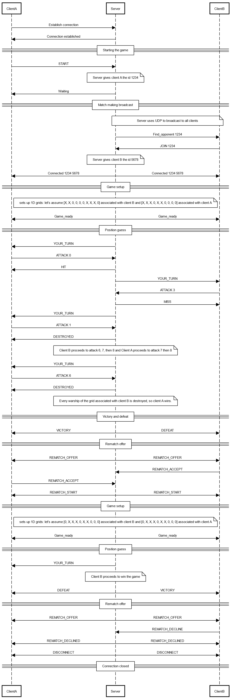

# Battleship protocol

## Section 1 - Overview

The "Battleship" protocol is a communication protocol that allows two clients to play battleship on a 1D grid against each other, with a server between them having the upper hand and communicating to each client what its opponent plays.

## Section 2 - Transport protocol

The "Battleship" protocol is a text-based communication protocol used for playing a Battleship game on a 1D grid between two clients. This protocol employs both UDP and TCP transport protocols to manage different stages of communication:
- **UDP** is used for broadcasting a match-making request from the server.
- **TCP** is used for reliable, sequential data transmission during gameplay.

Every message must be encoded in UTF-8 and delimited by a newline character (\n). The messages are treated as text messages.

### Game Setup and Matchmaking
The client A that wants to start a Battleship game sends a message to the server.

The server checks if client A is already engaged in a game:
- If yes, the server sends an error message to client A.
- If no, the server accepts the request, and broadcasts a match-making request over UDP to find an opponent for the client A.

Upon receiving the match-making broadcast, Client B responds to the server, indicating they want to join the game with client A.
The server checks if the client B has already started a game.

 - If so, the server sends an error message to the client. 
 - If not, the server accepts the request, and initiates a TCP connection with both client A and client B.

Once the two connections are established, the server generates two warship-filled 1D grids associated with each of the clients.

The server then prompts Client A to send their first attack position, represented by a number between 0 and 9.

### Gameplay
One turn proceeds as follows:

#### Client's attack
The client A sends the server a number.

The server checks if this number has already been sent by client A. 
- If so, the server asks client A to send a different position.
- If not, the server updates the grid of client B with client A's chosen position.

#### Server response
The server checks if the chosen position is covered by a warship.

The server replies accordingly : miss, hit, destroyed.

#### Switching turns
The server then prompts Client B to send an attack position.

Client B's turn proceeds similarly, with the server updating Client A's grid as appropriate and providing a result.

### Ending the game
The game continues in turn-by-turn format until one of the clients targets and destroys every warship on the opponent's grid.

#### Victory and defeat
When a client destroys all warships on the opponent’s grid, the server sends a victory message to the winning client and a defeat message to the losing client.

#### Rematch offer
The server asks the winning client if they would like to play a rematch:
- If the winning client accepts, the server sends a rematch offer to the losing client. 
  - If the losing client accepts, the server generates new grids and starts a new game.
  - If the losing client declines, the server closes the connection with both clients, informing the winning client that the rematch was declined.
- If the winning client declines, the server closes the connection with both clients.
## Section 3 - Messages

### Starting a Game

The client initiates a game with the server.

#### Request

```text
START
```

#### Response

- `WAITING`: the server is searching for an opponent.

### Matchmaking Broadcast

The server broadcasts a match-making message to find an opponent for client A.
#### Message
```text
FIND_OPPONENT <client_A_id>
```
### Joining a game
Client B responds to the server’s broadcast message to join a game with client A.

#### Request
```text
JOIN <client_A_id>
```
#### Server Response
- `CONNECTED <client_A_id> <client_B_id>`: game connection is successfully established between client A and client B.
- `ERROR <code>`: an error occurred. The error codes are:
  - 1 : a game is already in session for this client.

### Game Setup
Once both connections are established, the server sets up 1D grids and sends confirmation messages to both clients.

#### Message to Both Clients
```text
GAME_READY
```

### Position Guess (One turn)
The client sends a position guess, represented by a number between 0 and 9, to the server.

#### Request
```text
ATTACK <position>
```

#### Server response

- `MISS`: client’s position did not hit a warship. 
- `HIT`: client’s position hit an opponent’s warship.
- `DESTROYED`: client’s position destroyed an opponent’s warship.
- `ERROR <code> TRY_AGAIN`. The error codes are as follows:
  - 1: position has already been guessed by the client.
  - 2: position is out of bounds (not between 0 and 9)

In case of an error, the server asks the client to try again, until a valid input is given.

### Turn Notification 
The server informs each client when it’s their turn to play.

#### Message
```text
YOUR_TURN
```

### Victory and Defeat
The server notifies both clients when the game ends due to one client’s victory.

#### Message to winning client
```text
VICTORY
```
#### Message to losing client
```text
DEFEAT
```

### Rematch offer
After the game ends, the server asks the winning client if they would like a rematch.

#### Server message to winning client
```text
REMATCH_OFFER
```
#### Winning client response
- `REMATCH_ACCEPT`: the client accepts the rematch offer.
- `REMATCH_DECLINE`: the client declines the rematch offer.

### Rematch confirmation with losing client
If the winning client accepts the rematch, the server asks the losing client if they want a rematch.

#### Server message to losing client
```text
REMATCH_OFFER
```
#### Losing client response
- `REMATCH_ACCEPT`: the client accepts the rematch.
- `REMATCH_DECLINE`: the client declines the rematch.

### Rematch outcome
The server informs each client about the outcome of the rematch offer.

#### Messages
- `REMATCH_START`: a new game session will begin.
- `REMATCH_DECLINED`: the opponent declined the rematch, ending the session.

### Connection Close
When the rematch is declined, the server informs each client and closes the connection.

#### Messages
- `DISCONNECT`: the connection is closed by the server.

## Section 4 - Examples

#### Functional example


#### Client A enters twice the same position


#### 