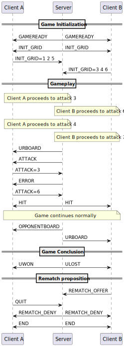

# Battleship protocol

## Section 1 - Overview

The "Battleship" protocol is a communication protocol that allows two clients to play battleship on a 1D grid against each other, with a server between them having the upper hand and communicating to each client what its opponent plays.

## Section 2 - Transport protocol

The "Battleship" protocol is a text-based communication protocol used for playing a Battleship game on a 1D grid between two clients. This protocol employs TCP protocol. TCP ensures reliable, sequential data transmission during gameplay.

Every message must be encoded in UTF-8 and delimited by a newline character (\n). The messages are treated as text messages.

### Game Setup and Matchmaking
The server sets up the game for it to begin. If a client attempts to connect before the server initiates the game, the connection is rejected.

Every client that wants to start a Battleship game sends a message to the server.

The server accepts the client's request.

Once the two connections are established, the server asks the two clients to fill their 1D grid associated.

If a client enters twice the same position, the server prints an error and asks for another position.

Once both clients have functional grids, the server starts the game.

### Gameplay
One turn proceeds as follows:

#### Client's attack
The server displays to the first connected client —let's call them Client A— their current grid.

The server prompts Client A to attack a cell, represented by a number between 1 and 16.

The Client A sends a number to the server.

The server checks if this number has already been sent by Client A.
- If so, the server asks Client A to send a different position.
- If not, the server updates the grid of the other client -let's call them Client B- with Client A's chosen position.

#### Server response
The server checks if the chosen position is covered by a warship.

The server responds accordingly : miss, hit.

It then displays to Client A the current state of Client B's grid, and to Client B the current state of their own grid. 

#### Switching turns
The server then prompts Client B to send an attack position.

Client B's turn proceeds similarly, with the server updating Client A's grid as needed and sending the result.

### Ending the game
The game continues in turn-by-turn format until one of the clients targets and destroys every warship on the opponent's grid.

#### Victory and defeat
When a client destroys all warships on the opponent’s grid, the server sends a victory message to the winning client and a defeat message to the losing client.

#### Rematch offer
The server asks both clients if they would like to play a rematch:
- If both clients agree to a rematch, the server starts a new game.
- If at least one of the clients declines, the server closes the connection with both clients.

## Section 3 - Messages

### Game initialization

- `GAMEREADY`(Server): The server informs the client that the game is starting. _Example Output_: "Game is starting!"

- `INIT_GRID`(Server): The server instructs the client to initialize the game grid. This is typically followed by a prompt for the client to arrange their ships.

- `INIT_GRID=<positions>`(Client): The client sends this command to inform the server of the initial placement of their boats.
  Format: INIT_GRID=pos1 pos2 ... posN
  Example: INIT_GRID=1 2 5

### Gameplay
- `URBOARD`(Server): The server sends the client an updated view of their own board. _Example Output_: "Your board:" (followed by the board layout).
- `ATTACK`(Server): The server prompts the client to make an attack on a specific cell of the opponent's grid.
- `ATTACK=<cell>`(Client) : The client sends this command to attack a specific cell on the opponent's board.
  Format: ATTACK=cell
  Example: ATTACK=5

- Result of the attack (Server):
  - `HIT`: The server informs both clients that Client A's attack successfully hit an opponent's ship. _Example Output_: "HIT!"
  - `MISS`: The server informs both clients that Client A's attack missed. _Example Output_: "Missed..."
#### Boards display
The two following commands are sent at the same time, the first to Client A, the second to Client B
- `OPPONENTBOARD`(Server): The server sends Client A an updated view of the opponent's board. _Example Output_: "Opponent's board:" (followed by the board layout).

- `URBOARD`(Server): The server sends Client B an updated view of their own board. _Example Output_: "Your board:" (followed by the board layout).

- `WAIT`(Server): The server instructs Client A to wait for the opponent's move. _Example Output_: "Waiting for opponent's move..."

### Game conclusion
- Game result (Server):
  - `UWON`: The server informs the client that they have won the game. _Example Output_: "YOU WIN!"
  - `ULOST`: The server informs the client that they have lost the game. _Example Output_: "YOU LOST!"

- Post-game options (Client):
  - `REMATCH_OFFER`: The client sends this command to offer a rematch after the game has ended. Sent when the client types "Rematch."
  - `QUIT`: The client sends this command to quit the game after the game has ended. Sent when the client types "Exit."

- Rematch response(Server):
   - `REMATCH_DENY`: The server informs both clients that the rematch has been denied. _Example Output_: "Rematch denied!"
   - `END`: The server informs both clients that the game has ended and the connection will be closed.

#### Error handling
  - `ERROR`(Server): The server informs the client of an invalid action, such as attacking a previously targeted cell. _Example Output_: "You already attacked this cell!"
  - Default (Unexpected Command)(Client): If the server sends an unrecognized message, the client should handle it gracefully. 
_Example Output_: "Unexpected command from server..."

## Section 4 - Examples

#### Functional example (no error printed by the server)

#### Client A attacks twice the same position

